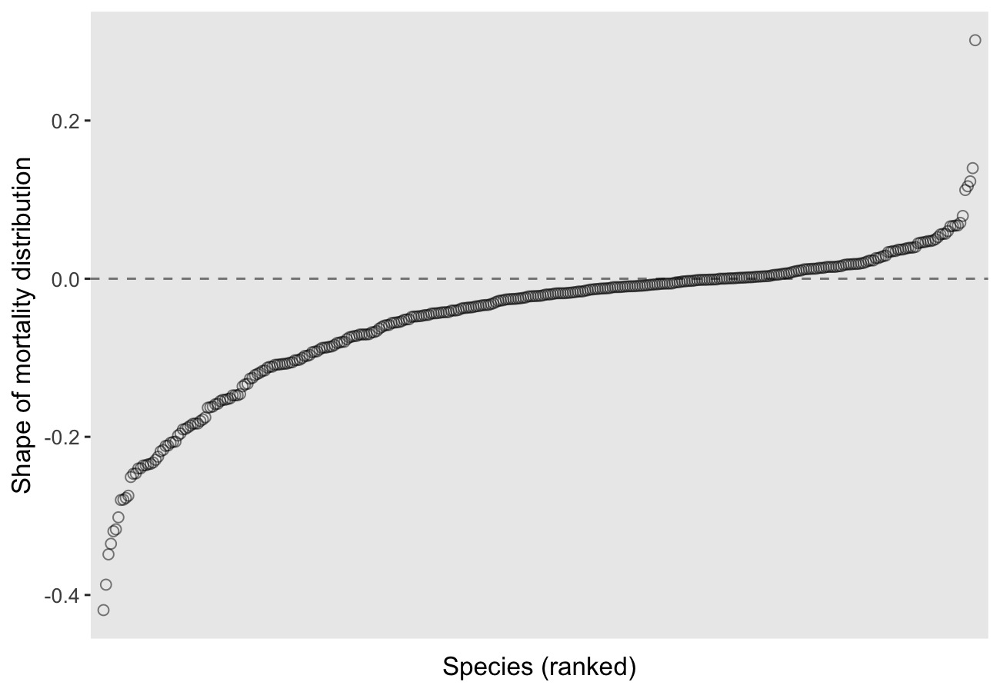

The shape of mortality trajectories in plants
================
Patrick Barks
2019-01-30

Whereas most animal species exhibit age-related increases in mortality and declines in reproduction (i.e. senescence), most plant species seem to do the opposite. Previous analyses with COMPADRE suggest that only about 1/5 of plant species exhibit age-related increases in mortality. Below I replicate those analyses.

Preliminaries
-------------

#### Install required packages

``` r
devtools::install_github("jonesor/Rcompadre")
devtools::install_github("patrickbarks/Rage", ref = "devel")
install.packages("tidyverse")
```

#### Load required libraries

``` r
library(Rcompadre)
library(Rage)
library(tidyverse)
library(rgdal)
library(rgeos)
library(maptools)
```

#### Helper functions

``` r
# subset lx trajectory to range t1:t2 (where t1 and t2 are the age of first
#  repro and time to quasi-stable distribution, respectively)
lx_sub <- function(lx, t1, t2) {
  lx <- lx[t1:t2] / lx[t1]
  lx <- lx[lx > 0]
  return(lx)
}
```

Prepare data
------------

#### Fetch COMPADRE and subset to matrices of interest

``` r
# fetch compadre db
comp <- cdb_fetch("COMPADRE_v.X.X.X.RData")

# subset to matrices of interest, and collapse to mean matrix by spp
comp_sub <- comp %>% 
  cdb_flag(c("check_NA_U", "check_NA_F", "check_zero_U")) %>% 
  filter(check_NA_U == FALSE,
         check_NA_F == FALSE,
         check_zero_U == FALSE,
         MatrixCaptivity == 'W',
         MatrixTreatment == "Unmanipulated",
         MatrixComposite != "Seasonal",
         MatrixPopulation != "FRANK",
         AnnualPeriodicity == 1,
         OrganismType %in% c('Herbaceous perennial',
                             'Tree',
                             'Shrub',
                             'Succulent',
                             'Palm'),
         MatrixDimension > 2,
         SurvivalIssue <= 1.05)
```

#### Collapse to mean matrix population model by species

``` r
comp_mean <- comp_sub %>% 
  mutate(id_stage = cdb_id_stages(.)) %>% 
  cdb_collapse(c("SpeciesAuthor", "id_stage")) %>% 
  cdb_unnest()
```

Analyze the shape of mortality trajectories
-------------------------------------------

``` r
comp_shape <- comp_mean %>% 
  mutate(check_zero_F = map_lgl(matF, ~ all(.x == 0))) %>% 
  filter(check_zero_F == FALSE, SurvivalIssue <= 1.0) %>% 
  mutate(start = mpm_first_active(.)) %>% 
  mutate(perennial = map2_lgl(matU, start, ~ mpm_to_lx(.x, .y, N = 3)[4] > 0)) %>% 
  filter(perennial == TRUE) %>% 
  mutate(la = pmap_dbl(list(matU, matF, start), mature_age)) %>% 
  mutate(la = map_int(la, ~ max(as.integer(round(.x, 0)), 1L))) %>% 
  mutate(q = map2_int(matU, start, ~ qsdConverge(matU = .x, startLife = .y,
                                                 conv = 0.01, N = 2000,
                                                 ergodicFix = TRUE))) %>% 
  mutate(q = ifelse(is.na(q), 2000, q)) %>% 
  filter(q - la >= 3) %>% 
  mutate(lx = map2(matU, start, mpm_to_lx, N = 2000)) %>%
  mutate(lxs = pmap(list(lx, la, q+1), lx_sub)) %>%
  mutate(lxs_max = map_dbl(lxs, ~ .x[length(.x)])) %>% 
  mutate(shape = map_dbl(lxs, shape_surv)) %>%
  mutate(l0 = map2_dbl(matU, start, lifeExpectancy)) %>% 
  mutate(id = as.factor(1:n()))
```

#### Example mortality trajectories

Below I show examples of two mortality trajectories: a trajectory of declining mortality from the coniferous tree species *Phyllanthus emblica*, and a trajectory of increasing mortality from the tropical tree species *Oxandra asbeckii*.

``` r
example <- comp_shape %>%
  filter(SpeciesAuthor %in% c("Phyllanthus_emblica_2", "Oxandra_asbeckii")) %>%
  mutate(age = list(0:50)) %>%
  mutate(hazard = map(lxs, ~ lx_to_hx(.x)[1:51])) %>% 
  CompadreData() %>%
  select(SpeciesAuthor, age, hazard) %>%
  unnest()

example_cv <- comp_shape %>%
  filter(SpeciesAuthor %in% c("Phyllanthus_emblica_2", "Oxandra_asbeckii")) %>%
  CompadreData() %>%
  select(SpeciesAuthor, shape) %>%
  mutate(label = paste0("shape_mortality==", formatC(shape, format = "f", digits = 3)))

ggplot(example) +
  geom_line(aes(age, hazard)) +
  geom_text(data = example_cv, aes(x = 10, y = Inf, label = label),
            hjust = 0, vjust = 1.8, parse = TRUE) +
  facet_wrap(~ SpeciesAuthor, scales = "free_y") +
  expand_limits(y = 0) +
  labs(x = "Age (years)", y = "Mortality hazard")
```


#### The shape of mortality trajectories across COMPADRE

Here's a plot showing the distribution of mortality trajectory shapes across all species in COMPADRE.

``` r
ggplot(comp_shape, aes(fct_reorder(id, shape))) +
  geom_point(aes(y = shape), size = 2, alpha = 0.5, pch = 21) +
  geom_hline(yintercept = 0, linetype = 2, alpha = 0.5) +
  scale_x_discrete(expand = c(0.015, 0)) +
  labs(x = "Species (ranked)", y = "Shape of mortality distribution") +
  theme(axis.text.x = element_blank(), axis.ticks.x = element_blank())
```



#### Biomes plot

``` r
# read ecoregions shapefile
ecoregions <- readOGR(dsn = "ecoregions", layer = "wwf_terr_ecos")
```

    ## OGR data source with driver: ESRI Shapefile 
    ## Source: "/Users/patrickbarks/shape-mortality/ecoregions", layer: "wwf_terr_ecos"
    ## with 14458 features
    ## It has 21 fields

``` r
# aggregate by biome, and simplify polygons
biomes <- ecoregions %>% 
  unionSpatialPolygons(ecoregions@data$BIOME) %>% 
  gSimplify(tol = 0.1)

# read df with biome names
biome_names <- read.csv("biome_names.csv") %>% 
  mutate(biome = factor(biome, levels = biome))

# fortify for plotting
biomes_tidy <- fortify(biomes) %>% 
  as_tibble() %>% 
  mutate(id = as.integer(id)) %>% 
  left_join(biome_names, by = "id") %>% 
  filter(lat > -56) %>% 
  filter(biome != "Lake")

# plot colors
biome_cols <- c(
  viridis::viridis(10),
  # med, desert
  "#ff7f00",
  "#b15928",
  # mangrove
  "#fb9a99",
  # tundra, ice
  "grey75",
  "grey50"
)

# plot
ggplot(biomes_tidy) +
  geom_polygon(aes(long, lat, group = group, fill = biome), alpha = 0.8) +
  scale_fill_manual(name = NULL, values = biome_cols, guide = guide_legend(nrow = 5)) +
  labs(x = NULL, y = NULL) +
  theme(legend.position = "bottom",
        panel.grid = element_blank(),
        axis.text = element_blank(),
        axis.ticks = element_blank())
```


